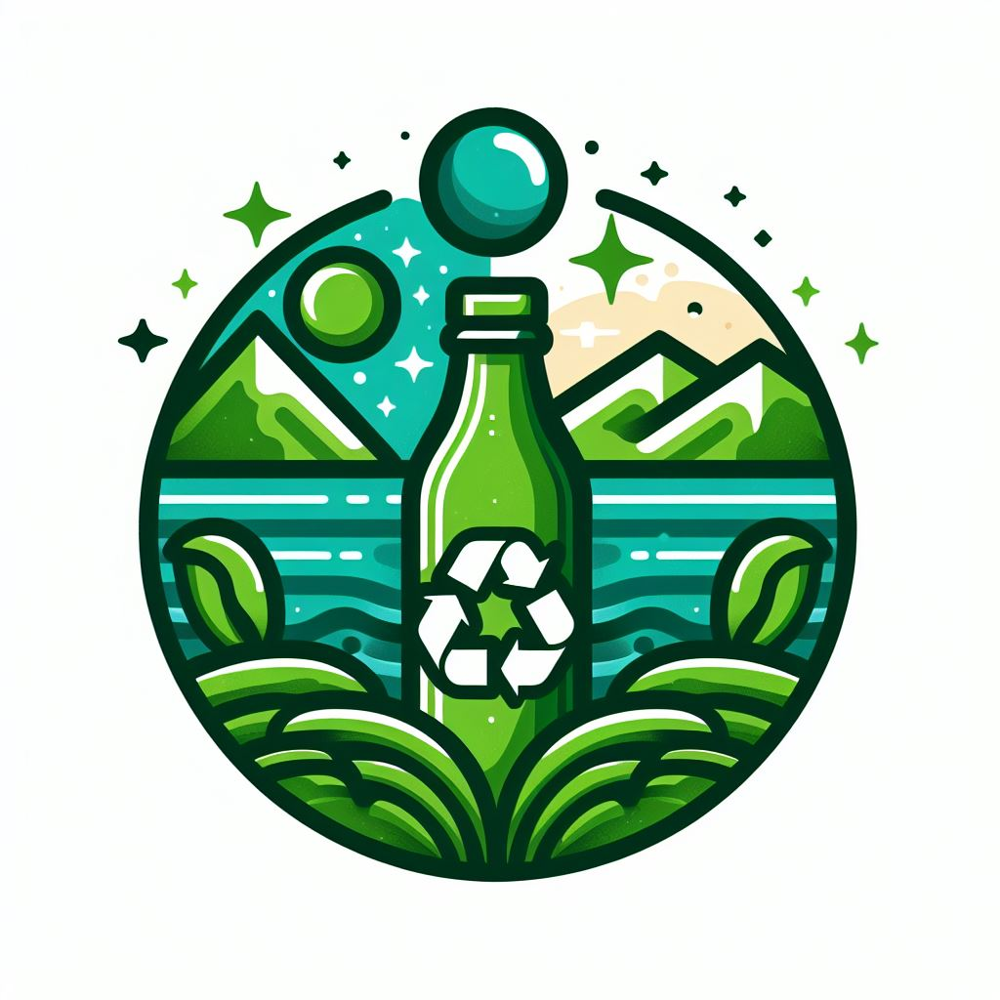

# Bottle Recycling System

## Developer

Metehan Saman is a student studying Electrical and Electronics Engineering at Abdullah Gul University. To enhance his skills in the software world, he participated in the Rise In Internet Computer Rust Workshop. This event provided Metehan with the opportunity to learn the Rust programming language and further strengthen his software development skills. With a passion for software development in various languages, Metehan aims to utilize software effectively in different fields of engineering in the future. Metehan aims to improve his future successes with his technical knowledge and software skills.

## Project Description

This project is designed as a system to facilitate and track bottle recycling for users. Through this system, users can perform a series of operations. Initially, users can add bottles and record the number of bottles they have collected in the system. Subsequently, the system allows users to check their bottle counts and the balance in their accounts, enabling them to track the amount of recycled bottles and accumulated balance.

Additionally, users can convert accumulated bottles into money using the system. This process occurs based on a set of rules calculated according to the accumulated bottle count and is added to the user's balance. Finally, users can withdraw the accumulated money from their accounts.

The system also includes an authentication mechanism to securely log users into their accounts. This ensures that only authorized access is granted to users' accounts, preserving their personal information. This authentication mechanism employs modern cryptographic methods to securely store users' secret passwords.

Overall, this system aims to encourage environmentally friendly behavior by allowing users to monitor, manage, and track their recycling activities and the income derived from these activities.

## Vision

The vision of this program is to create an environmentally conscious community and promote recycling habits. This system aims to reduce environmental impact by encouraging greater participation in the recycling process by users. Its goal is to increase environmental awareness by enabling users to more easily manage and track their recycling activities. By promoting widespread recycling habits throughout the community, it aims to contribute to the conservation of natural resources and environmental sustainability.

## Features

1. **Secure Authentication**
   - Users authenticate securely with a password to access their accounts. Passwords are securely stored using the SHA-256 algorithm.

2. **Bottle Tracking and Balance Calculation**
   - The system tracks the number of bottles added by users and calculates the value of each bottle. Users can check their added bottle count and balance at any time.

3. **Automatic Money Conversion and Withdrawal**
   - Users can convert the bottle count in their accounts into money at a specified value and withdraw this money using the withdrawal option. The system automatically performs this conversion and updates users' balances.

4. **Integration with ICP**
   - The system now integrates with the ICP, enabling the secure access to user accounts and transactions.

## Installation Details

To run the project in a local environment, follow these steps:

1. **Download or Clone the Project:**
   - First, clone the project from the GitHub repository or download it as a zip file.
     - To clone, you can use the following command: `git clone https://github.com/MetehanSaman/rust_bootle_recycle`
     - If you downloaded it as a zip file, extract the files to a folder.

2. **Open a Terminal:**
   - Open a terminal or command prompt to navigate to the project directory.
     - After downloading or cloning, navigate to the directory of the project folder.

3. **Run the Project:**
   - Make sure you are in the project directory in the terminal.
     - Then, run the project using the following command: `cargo run`
     - This command will compile the Rust project and then execute it.

4. **User Welcome and Operation Menu:**
   - After successfully running the project, the system will greet you and present the operation menu.
     - In this menu, users can add bottles, check bottle counts and balances, convert bottles into money, and withdraw money.
     - By following these steps, you can successfully run the project in a local environment and start performing operations on the system.
